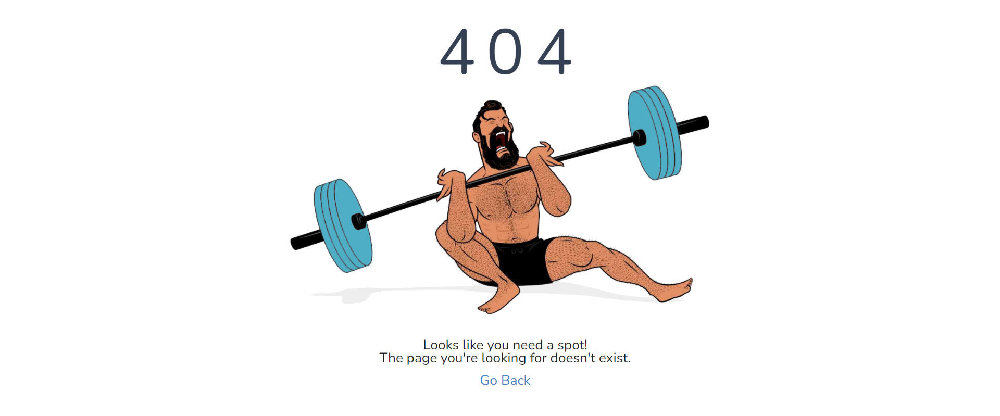

# Swole-Mates 💪🏽💓

<a name="descsection"></a>
## Description
Here at SwoleMate we are passionate about two things: Getting swole and finding mates (mates as in friends, ya perv). This application is a MERN stack, single-page application and utilizes ReactJS, tailwindCSS, Node JS, ExpressJS, GraphQL, MongoDB, JWT, PWA, Stripe, Spoonacular API, Quote API, and so much more... Enjoy not only tracking your workouts and researching your food's macro-nutrients, but also lurking your friends. Sign up today to find your one true swole mate 💓

[](https://opensource.org/licenses/MIT)


## Table of Contents
1. [ Description. ](#descsection)
2. [ User Story. ](#usersection)
3. [ Acceptance Criteria. ](#acceptancesection)
4. [ Installation. ](#installsection)
5. [ License. ](#licensesection)
6. [ Contributing. ](#contribsection)
7. [ Tests. ](#testsection)
8. [ Questions. ](#questionssection)
9. [ Screenshots. ](#picsection)
10. [ Links. ](#linksection)
11. [ Resources/Credit. ](#creditsection)

<a name="usersection"></a>
## User Story
```
AS A swole mate,
I WANT a site where I can track both mine and my mate's exercises, weight, calories, and goals
SO THAT I can find my one true swole mate and continue to grow my fitness journey
```

<a name="acceptancesection"></a>
## Acceptance Criteria
```
Given an unauthenticated user
WHEN I arrive at the website
THEN I am presented with a welcome page that transitions to a login page
IF I don't have an account, I can click sign up and be routed to the sign up page and profile page
THEN I am able to sign up by entering a unique email and a password twice that must match and be at least 8 characters
WHEN I have an account, I login with my authentication
IF I enter my login information, I am rerouted to the home page, else I receive an error that my username and/or password is incorrect

Given an authenticated user
WHEN I select login, I am routed to the home page
THEN I am presented with a dashboard of my calorie chart, current weight, my fitness goal, and inspirational quotes
WHEN I click on the navigation bar, I am able to go to the food, exercise, mates, or sponsor page
WHEN I click on 'Food' in the nav bar 
THEN I am presented with an option to see weekly meal recipes or view nutrients for single food items or recipes
WHEN I click on 'Exercise' in the nav bar 
THEN I am presented with my logged workouts and am able to log my cardio, strength, and/or stretching sessions
WHEN I click on 'Mates' in the nav bar 
THEN I am presented with my profile card and the ability to search for active user's by e
WHEN I click on 'Sponsor' in the nav bar 
THEN I am presented with a list of exercises I can purchase securely using Stripe payment
WHEN I go to an invalid route
THEN I am presented with a 404 error and an option re route back to the home page
WHEN I click logout or am idle on the site for too long
Then I am redirected to login page
```

<a name="installsection"></a>
## Installation
* Clone the repository using:
```
git clone https://github.com/jonteal/SwoleMates.git
```
* Ensure you are in the current working directory
* Install dependencies by opening the terminal (ctrl + j on windows) and running:
```
npm install || npm i
```
* Seed the database
```
npm run seed
```

* Run the project by typing the following in the terminal:
```
npm run develop
```

<a name="licensesection"></a>
## License
Copyright <2021>

Permission is hereby granted, free of charge, to any person obtaining a copy of this software and associated documentation files (the "Software"), to deal in the Software without restriction, including without limitation the rights to use, copy, modify, merge, publish, distribute, sublicense, and/or sell copies of the Software, and to permit persons to whom the Software is furnished to do so, subject to the following conditions:

The above copyright notice and this permission notice shall be included in all copies or substantial portions of the Software.

THE SOFTWARE IS PROVIDED "AS IS", WITHOUT WARRANTY OF ANY KIND, EXPRESS OR IMPLIED, INCLUDING BUT NOT LIMITED TO THE WARRANTIES OF MERCHANTABILITY, FITNESS FOR A PARTICULAR PURPOSE AND NONINFRINGEMENT. IN NO EVENT SHALL THE AUTHORS OR COPYRIGHT HOLDERS BE LIABLE FOR ANY CLAIM, DAMAGES OR OTHER LIABILITY, WHETHER IN AN ACTION OF CONTRACT, TORT OR OTHERWISE, ARISING FROM, OUT OF OR IN CONNECTION WITH THE SOFTWARE OR THE USE OR OTHER DEALINGS IN THE SOFTWARE.

  <a name="contribsection"></a>
## Contributing
  
1. [Fork the repo!](https://docs.github.com/en/get-started/quickstart/fork-a-repo)
2. Create a feature branch:
```
git checkout -b yourname-branch
```
3. Commit changes:
```
git commit -m 'Your changes here'
```
4. Push to the branch:
```
git push origin yourname-branch
```
5. Submit a pull request and wait for it to be approved or denied.

  <a name="testsection"></a>
## Tests

Run tests using jest in the client folder, simply type:
```
npm run test
```

  <a name="questionssection"></a>
## Collaborators?
  Meet the swole mates who created this app:

* Eric Martin: [GitHub](https://github.com/EMtheDM)
* Jon Jackson: [GitHub](https://github.com/jonteal)
* Laurel Thorburn: [GitHub](https://github.com/laurelthorburn)
* Ryan Paragas: [GitHub](https://github.com/ParagasR)
* Valerii Bihun: [GitHub](https://github.com/Valllerian)

  Questions/comments/concerns? Please send an email to codinglaurel@gmail.com
  
  <a name="picsection"></a>
  ## Screenshots
  
  
  
  
  


  <a name="linksection"></a>
  ## Links

  Deployed Heroku Site: https://true-swole-mates.herokuapp.com/
  
  Github Site: https://github.com/jonteal/SwoleMates

  <a name="creditsection"></a>
## Resources/Credit
* https://stackoverflow.com/questions/49108136/importing-env-variable-react-front-end
* https://www.w3schools.com/howto/howto_css_shake_image.asp
* https://github.com/reactjs/react-transition-group/tree/v1-stable
* https://github.com/azmenak/react-stripe-checkout
* https://athemes.com/collections/best-css-frameworks/
* https://www.npmjs.com/package/@craco/craco
* https://v2.tailwindcss.com/docs/guides/create-react-app
* https://reactjs.org/docs/forms.html
* https://stackoverflow.com/questions/7372067/is-there-any-way-to-prevent-input-type-number-getting-negative-values
* https://www.csusm.edu/ipa/surveys/inclusive-language-guidelines.html
* https://stackoverflow.com/questions/3828554/how-to-allow-input-type-file-to-accept-only-image-file


